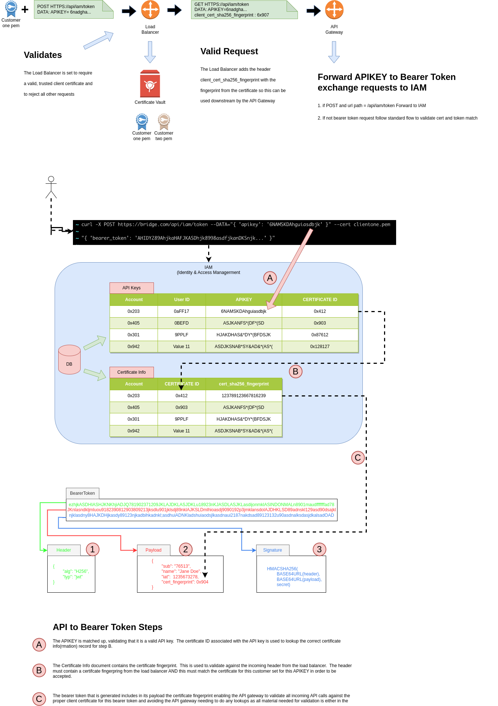
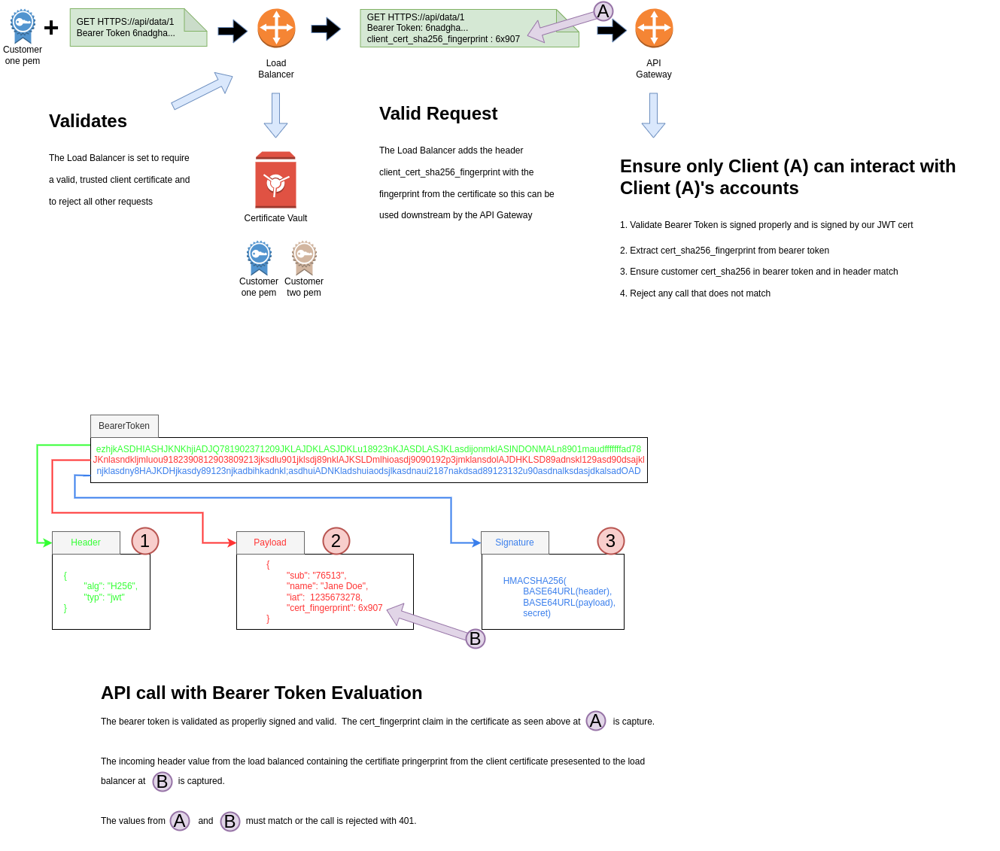

# MFA (Multi-Factor Authentication) for APIKeys 

  Adding MFA to your apikey strategy can dramatically increase the security of your solution.  
  

## MFA for Carbon 
  I am sure most everyone is familiar with MFA for user logins where you will receive a text message with a code you 
need to enter or where, if you are lucky, you can use biometrics like the fingerprint reader on your phone or laptop.  Worst
case you get the dreaded e-mail to click after waiting for it to finally arrive.

## MFA for Silicon
  So we could get our app to read an e-mail inbox via pop3 or imap, there is also a better way.  And no it is not 
registering a phone number for text messages :).  Enter client side certificates.  Client side certificates are an excellent
way for a program to identify itself uniquely.  When coupled with APIKEY Authentication you now have multiple authentication
factors (an API KEY and a Certificate) that must both match forming MFA for your APIKEY Strategy and impressing all your friends
and family.  

## Tying it together in a multi-tenant world
  In a single tenant (i.e. Customer) deployment world you can easily setup each independent customer environment to require
and check for only the client certificates associated with that single customer.  Thus adding MFA to your APIKEY strategy when
running independent software deployments for each customer is very straightforward.  If you host multi-tenant which has you 
supporting multiple customers all using a single instance of your software then things quickly get more interesting and complex.

## Needs in a multi-tenant deployment

* Each client can have one or more client certificates to authenticate with
* API Calls to each clients tenants are only allowed when accompanied by that clients certificates
* In short only calls to client A's tenants are only allowed when accompanied by client A's certificates
* As all [APIs authenticate with bearer tokens](../bearer-token/api-key.md), following best practices, bearer tokens and api keys must be supported
* [API first architecture](../bearer-token/api-first.md) has bearer tokens used for UI/web browser flows as well as for API calls from API keys

# Design
  The following shows the design for levering an API gateway and IAM service to manage client certificates for all API
calls not originating from the browser.  There are two paths to consider.  One is incoming calls with an API Key where the caller
is exchanging their API key for a bearer token for use in subsequent API calls.  This is the method that does all the heavy lifting
and that is a key design goal as in any normal system the majority of API calls being processed are those authenticating with a
bearer token.  So having the majority of the processing on this call means that all other api calls, using bearer tokens, have the
least additional impact.  The second set of calls to handle are those where we are processing an incoming bearer token and need to
validate that the bearer token and client certificate match to the same customer tenant.

## APIKey Authentication and bearer token generation

  As can be seen below incoming requests to swap an API key for a bearer token will handle validating that the incoming call has
the proper client certificate and will then generate a bearer token with additional information about the specific customers
certificate such that any api calls made with the bearer token can easily validate the proper client certificate is being used.

## Bearer Token Authentication
  
  With all the hard work done in the previous step the API gateway need only validate the bearer token and match the value stored within it
to the value passed in as a header from the load balancer for the callers client certificate.

