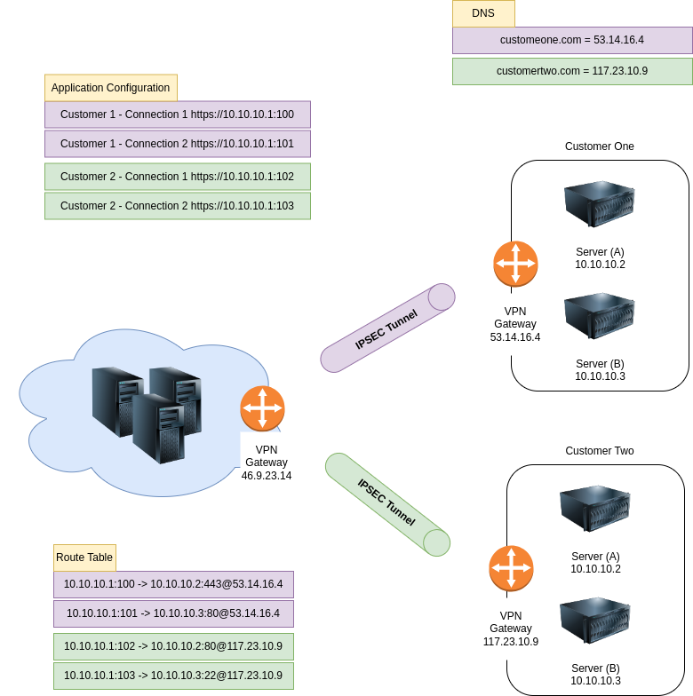

# API Gateways are the future, VPNs are the past

  That is a bold statement.  Surely many people who love networking and who have spent many years 
  recommending VPNs as part of their architectural solutions will find this statement hard to stomach.  
  While that is not the goal of this post it is important to get people thinking about the potential 
  implications of a world where API Gateways become common across the industry.  It is easy to consider
  API Gateways as just yet another component in the long list of technologies that are deployed as
  part of a solution.  Add a load balancer, add a firewall, add an API Gateway, etc.  However only seeing
  API Gateways in that light leads to missing out on the additional security controls that an API Gateway
  can provide and how these can be leveraged to provide a strong security posture with better governance.

## How we use VPNs in general

### The good
  Historically the way to control programmatic access between two systems in different network realms, such as between 
two companies, was to establish a VPN.  Wih a VPN we can be sure only the systems at in the source company that can reach the
source side of the VPN are able to access any of the systems at the destination end of the VPN.  You can further restrict 
which set of IPs can be reached and which port(s) are available on each of those IPs.  
  
### The bad
  While it was possible to restrict the port and IP at the destination it was not possible to restrict what happened at the
given port and IP.  So while you may have intended to expose the IP and PORT to your JIRA server, as an example, you have no way to restrict the 
interactions to only access the JIRA API at the given port and IP.  While it should be a JIRA server if there is something listening
on the port that speaks SSH then, well, you just exposed ssh access to an external company.  While this is not common it just speaks
to the limitations that exist when operating at layer 3 of the networking stack.

### The ugly
  VPNs only stop access to the first hop in the chain.  If any exposed IP/Port pairing supports SSH then everything visible to the first 
system is now at risk of being detected, attacked or accessed from the first server.  Your risk and exposure only grows from here.  Not allowing SSH
is great however VPNs do not operate at layer 7, so they do not have the ability to block SSH or any other protocol from being used.  It is also 
far too easy for someone to make a single typo on a CIDR and instead of exposing 4 IPs in a block they instead exposed 32 IPs, or far more.  The potential
for mistakes when working with exposing your network via a VPN is quite high and the ability to detect those issues before they are exploited is low.

## So what's this API Gateway thingy?
  An API Gateway is a solution that acts as a bridge to expose and govern access to services within your network.  It operates at layer 7 of the networking stack and is able
to restrict communications to specific protocols such as HTTP, gRPC, WebSocket and others.  Thus, you are able to ensure that only API communications can occur.  By restricting
access to only specific protocols you can ensure that no one is able to SSH into your systems, nor any other protocol you do not intend.  You further restrict which APIs can be 
interacted with so that you have granular control over what you are exposing as part of each integration.  In addition to having granular control over each API exposed to each 
  external party you can augment this with requiring a unique SSL certificate be presented with a different certificate used for each integration.  And you get to do all of this
without ever exposing your raw host/port network access to anyone.  

   
## Sounds cool what does this look like in action?

  In a VPN setup as shown above we have a single environment where we are going to establish communications with two customer environments.  In this case we would setup some IPs on the source side as virtual (not real IPs) that the source side VPN will handle.  Traffic for those IPs is then mapped to the correct client side VPN.  Each client side VPN is then further configured as to which IP/Port within the customers network the traffic should route to.
  Once you have the VPN setup (route table is a simple view of these types of configuration), you then need to setup the actual configuration of the applications at the source so they target the proper IP/Ports on the source side that ultimately route into each customers
internal environment through their VPN.

NOTES:
Given all the mapping and NATting that often occurs due to a lack of virtual IP space, most configurations are unique IP/PORT pairings and it is not uncommon to have many communications flowing through a single IP with different ports on the source side for a single IP ultimately leading to many IPs on the destination side.  This compression of the addressing space makes the configuration cryptic and prone to mistakes.  Remembering that port 201 on an IP is customer (A) JIRA Server ulimately at port 443 (HTTPS) and that port 301 on the source side is for a different customers server is not obvious.  Thus you need very tight interlock between the network/VPN configuration team and the application configuration team and any disconnect between parties leads to incorrect configuration and data going the wrong way to or from the wrong customer.  

.drawio.png)

In an API Gateway outbound to clients, as above, each client has their own API Gateway which is used in lieu of VPNs.  The customer grants our source certificate access to just the APIs they are exposing to us.  There is no routing table.  There is no dealing with virtual IPs, NAT, or using random ports.  Configuration is only 
necessary at the application layer and it is done against public hostnames and servers with valid certificates.  ]

.drawio.png)

In an API Gateway inbound from clients, as above, each client has their own client side certificate to identify themselves.  At the inbound API Gateway a separate configuration is created for each client where only the certificate unique to that client is authorized access.  Once again no routing, no nat, no cryptic IP/PORT pairings.  Just very clear and clear configuration and all using pubic IP/hostnames all with certificates

  