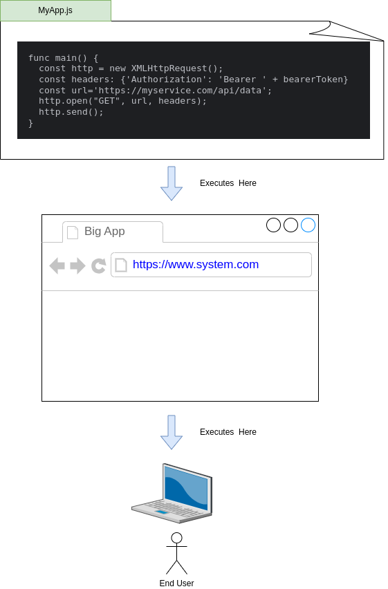

# API First

  Often teams fail to recognize the importance of structuring their software architecture to be API First.  They expose APIs and they build UIs and they fail to see the relationship between these two efforts.
This blog is about the importance of understanding how next generation software UIs work and how that relates to your API First Approach.

## Next Generation UIs
  UIs have changed dramatically over the last 30 years and while they used to just consist of a server rendering and sending dumb static pages to a users browser that model is now long gone.  Current generation 
applications consist of a program running in the users browser on their device.  These "UIs" are full-fledged programs which interact with the applications servers by making API
calls to those servers.  Gone are the days of a server doing all the processing on the backend.  Shifting some of the processing to the users browser allows for far more responsive, scalable and capable applications to be produced.

  The following is a rendering of a simple application which is going to make an API call to its backend servers to get some data that it will then render to the user.

  

  As can be seen above the program running in the browser is constructing and making an API call just like any other system would.  The program running in the browser sets an authorization header and makes the call to 
some server that is serving up its API.  What is most interesting in this pattern is that this allows for an API First approach to be taken.  
  

## API First
  API first, imho, is focusing on building a solution where the API that is exposed for your own UI is also made available to all others to use as they wish.  This means that other interfaces can be built upon your API
that you never envisioned.  This allows automation to be built leveraging your apis that you never envisioned.  By focusing on having a robust API that fully and correct supports the CRUD lifecycle of your
resources and data you are enabling the construction of an infinite set of solutions all built upon your API.  By ensuring your UI is built atop that same API means you are truly exposing a full robust API as a true API
First solution.

### Summary
  Ensure that you focus on building out a full set of APIs for your resources and their full CRUD lifecycle.  And use these to power your UI.  Doing so enables many other solutions to be 
constructed around your software than you imagined during construction.  If someone wants to build around or on top of you they can without ever needing you to do any new development.  This is just smart engineering.