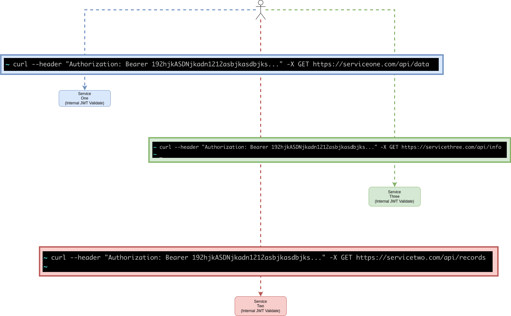
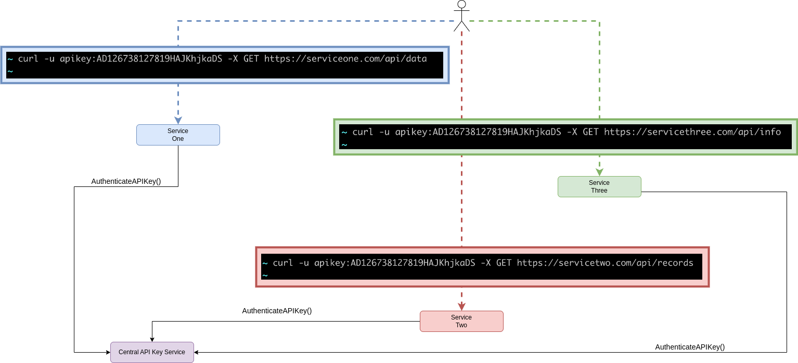
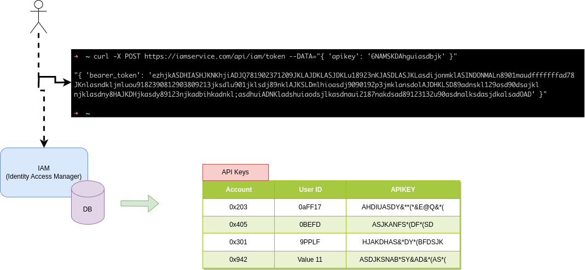

# API Keys and Bearer Tokens

  Long ago as we started to build up an IAM we had to decide how to best implement support for API Keys.  We had already chosen JWT (JSON Web Token) as our 
mechanism for handling authentication of incoming API calls from the browser.  The choice of JWT meant we did not need to centralize authentication, and we 
could enable authentication to be handled as a very nice horizontally scalable solution.  In addition, the choice of JWT tokens meant that each system/application/service
could not only independently authenticate incoming API calls, in addition they could each manage authorization independently as well.  
  When you are building a platform it is always important to seek out ways to enable loose federation and independent operations across the ecosystem.  JWT fit the bill and
is commonly used in our industry.  So now how about API Keys?

## Characteristics of API Keys
* Require a central authority to validate them and to translate them into an identity that can be trusted
* Are long lived (many days/weeks/months) as they are often used as part of programmatic integration between systems 

## Authentication Pattern with JWT Tokens

As can be seen above each service independently validates the JWT token.  There is no need for any central service to process the JWT as it is a signed entity and the only knoweldge
that each service requires is to know which JWT token signer to trust. 

## Authentication Pattern with API Keys

When systems all support accepting APIKeys directly against each API this requires all services to utilize a central service to validate the API key for every single API call made 
across the complete ecosystem.  This is a great deal of unnecessary load and tight coupling.

## Designing a robust and loosely coupled solution
  Given the issues with accepting API keys directly against each API for authentication we chose a model that is also used across many clouds including Google, Amazon, IBM.  This is to
provide a simple API Key to bearer token service.  This services whole mission is solely to authenticate an APIKey and return a bearer token (JWT signed) back to the caller to use in
making API calls against the various services.  Each service can then validate the token and identity of the caller using the identical support they already have for accepting
bearer tokens from incoming API calls from the browser for normal user interactions.  Each system/service/application is also free to apply their own authorization as they see fit.  Nice
and loosely coupled.

  In the above example the API key is presented to the central IAM (Identity Access Management) system and this system validates the API Key and generates a signed bearer token that the
caller then uses to authenticate itself in subsequent calls to the various apis across the complete ecosystem.

