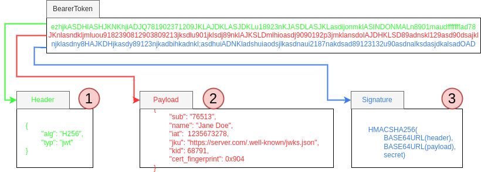
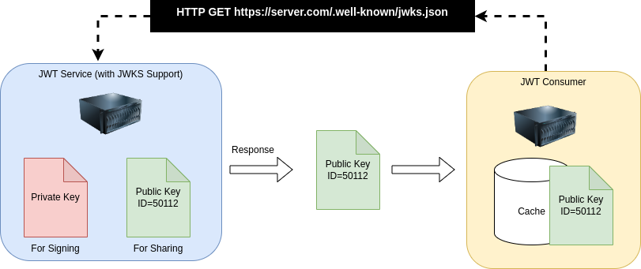

# JSON Web Tokens

  JWT or JSON Web Tokens are commonly used for authentication for APIs in systems.  This post is about some of the key properties of those tokens and how they can be used.

## JWT Bearer Token
  So what is a Bearer Token or JWT (JSON Web Token)?  These are json objects that are signed with a private key that any consumer can validate using the public key for that signer.  The signer
includes a link to their public key in the signed token and the receiver can fetch that public key and cache it.  Someone accepting a JWT needs to have a whitelist of which signers they 
trust.  This is most easily done by whitelisting the single URL for the public key for the signer you trust.  The url is the `jku` element of the JWS portion of the JWT.

#### JWTBreakDown
1. This is the header and specifies they type of JWT
2. This is the payload where claims (more on that below)
3. This is the signature which is how you can determine and verify that this token and its data can be trusted

#### Claims
  The claims, the portion 2 above, is where data is presented.  Claims come in two forms, standard and extended.  Standard are well defined in RFCs while extensions are additional
data elements that each JWT issuer can choose to add as they see fit.  In this post we will focus on just a few of key standard claims.

* iat - This is when the JWT was issued (timestamp) - This token is not valid before this time 
* exp - This is the time at which this JWT is expired and no longer valid (timestamp) - This token is not valid after this time
* sub - This is the subject (aka identity) of the caller think bob@mycompany.com or more likely a UUID for a given user
* iss - This is who issued the JWT (the creator of JWT)
* jku - This is the URL where the public key for this JWT can be retrieved from
* kid - This is the ID of the public key at the JKU

### Trusted Signer
  Note the JKU and KID entries in the payload section 2 below.  You should whitelist the URLS you trust as a consumer of JWT.  The KID or Key ID refers to which key at the JKU this JWT was signed with.  This is important as 
people will rotate the keys they use to sign as keys do not last more than 10 years and most teams will use shorter lifespan keys.  In the event of a security incident they might need to replace a key due to 
compromise.  To guard for this a consumer should cache the public key they received from the trusted JKU along with the KID of that key.  For each new JWT they decode they should check the KID and JKU and if they have not 
changed they can continue to use the key.  

  The above is a simplified view of how JWKS is used between a JWT producer/signer that supposed JWKS and the consumer of those JWT tokens.  

What is important to understand, from my perspective, is how nice and cleanly this can be used in a solution allowing many consumers and a very loose coupling between JWT producer and consumer.  Leveraging JWKS
enables a solution where the only form of tight coupling between parties is knowledge of the trusted JKU URL.

## Key Links
* [JWT.IO](https://jwt.io/)
* [JWT (JSON Web Token)](https://datatracker.ietf.org/doc/html/rfc7519)
* [JWKS (JSON Web Keys)](https://datatracker.ietf.org/doc/html/rfc7517)
* [JWS (JSON Web Signature)](https://datatracker.ietf.org/doc/html/rfc7515)

