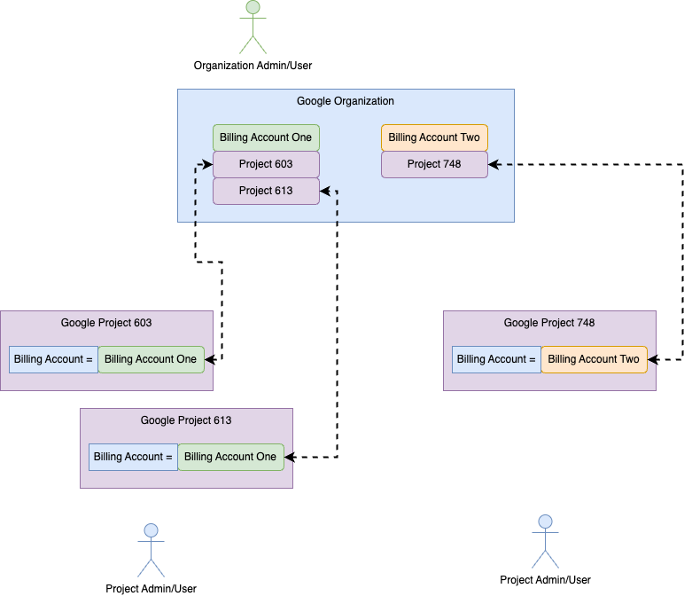
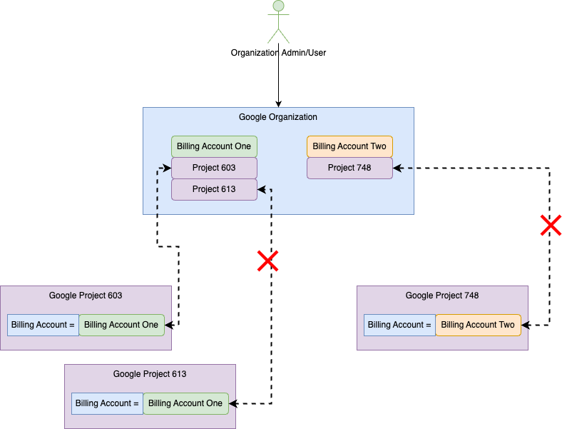
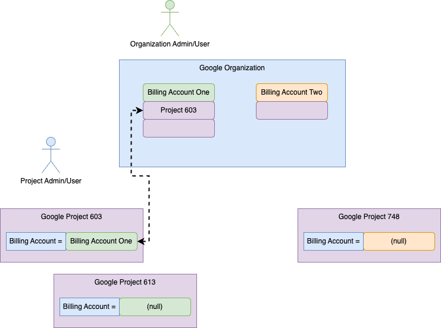
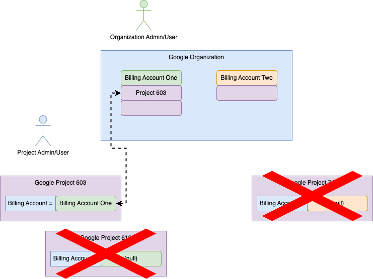
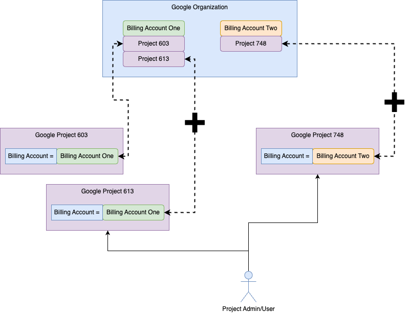

# Cloud Billing

 We recently experience an outage due to mistakes made with a billing account in Google.  This was a new one and surely came
at us out of left field.  It took us some time to get underneath and proved to be an eye opening experience around how clouds
and their automated nature can cause a seemingly small mistake to wreak havoc.
 

## Overview

  The above shows one of the ways many teams will setup and use Google.  In the above model a Google Organization is used to 
manage various aspects of the companys Google cloud usage.  Specifically for billing this often involves the creation of one or 
more billing accounts as part of that organization.  And then these billing accounts are associated with the different projects 
in the google cloud for the company.  This makes it easy pay for all the various Google projects in a company.  Having multiple 
Google projects associated with a single billing account can simplify the work for the finance team.  As 99.99% of all individual
projects in the company all use the central finance department in their company this is just a very normal approach.

  You will notice that each project has it's own billing information as projects can each be directly billed to a credit card or other
billing mechanism and it is very normal for a company to initially start using Google by just establishing one or two projects and handling
the billing directly with each project.  Once the company scales up they will then adopt the Google Organizations to help organize and manage
their broader use of the Google Cloud.

  This above pattern means that both the team operating on the Organization and the teams operating on the projects can affect the 
billing for each project.  And this joint stewardship is not so obvious to either party as the finance team tends to focus solely on using the 
google organization elements while the individual groups in the company using Google cloud will operate solely at the project level.

### Anatomy of an outage

 The following steps are a walkthrough of a recent outage we experienced and capture the steps that led to the outage as well
as those used to recover from it.   

### Step 1 - Problem

 
  At 3:30 AM on December 1st an administrator went to the organization in google and removed a number of projects from their associated
billing accounts.

### Step 2 - Result

 
  With the relationship between the billing account and the projects removed at the organization this then left each project without any
valid billing information.

### Step 3 - Outage

 
  With no valid billing account the google cloud services shutdown for this project and as soon as they shut down this caused an outage
for our services which ran under these projects.

### Step 4 - Recovery

 
  Fortunately we had our projects admins in our operations team who located the lack of billing account information and reconnected these from
within the individual projects.  We reached out to our finance and the organization admins however neither are part of operations and none are on 24x7 pager duty rotation.
We were very fortunate to have each project admin with the ability to update these settings, so we could recover from this issue in a timely fashion.

### Lesson learned
  It is critical for the operations team to coordinate changes to the billing information with finance and to ensure that no billing accounts are ever
removed or altered without a very careful review by all involved parties.  Given the level of automation that exists in the cloud even a erroneous billing account edit can easily render your productions systems out.
In the old world if the finance team failed to pay a vendor you would know about long before the service was shutdown.  
However, in the cloud, even a simple mistake by finance can render you down in minutes. 
  
  Having to explain to your executive team on how you enabled a finance team to take down a key company service on your watch is not a good conversation. 
It is far better to treat your finance team well, ensure any changes are carefully coordinated and that your operations team is ready and able to fix any billing config mistakes quickly if and when they arise.