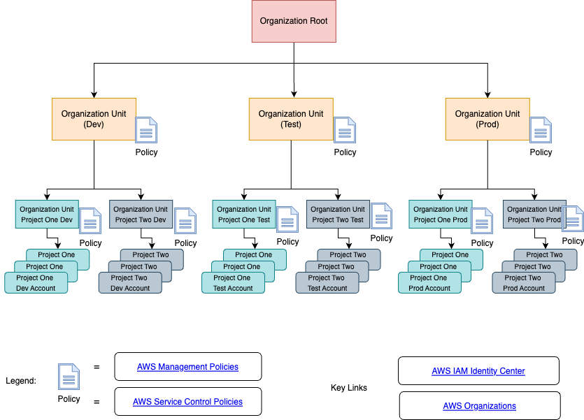

# Hyperscaler Account/Project/Subscription Governance

  Enabling teams to adopt and embrace the hyperscalers while concurrently applying security and governance can easily
be seen as two conflicting goals.  And based on how it is approached it often is for many teams.  However, that need not
be the case.  By incorporating the latest DevOps and GitOps approaches teams can reach a balance that provides good 
governance while also enabling teams to operate independently and enabling them to leverage the best of the hyperscalers. 
  
## Governance Goals

 The following are some common governance goals for teams:

1. Finance - Control Costs and ensure teams do not go outside their budget
1. Security - Ensure proper security measures are in place for all user access via UI and API to the Cloud Platform
1. Security - Ensure proper security measures are in place for all services that are placed within the cloud
1. Security - Ensure proper security monitoring tools are used to detect breaches of the security
1. Security - Ensure only security team approved cloud services are used by teams

The above are just a few of the many forms of governance teams seek for their cloud adoption.  This blog is not intended to cover
all of the various forms of governance but instead to focus on how to manage a governance lifecycle where policies will evolve over time
and to enable various independent development and operations groups to work together in rolling out these changes in a successful manner.

## Engineering Goals

 The following are some common operational goals for engineering and operations teams:

1. Outage Avoidance - Never do anything in production that was not done previously in a lower environment
2. Fast - Automate everything, no manual steps, no service now, no old world IT/ITIL Service Management
3. Flat - Push decision-making down to the lowest appropriate level

## Overview

  The above diagram includes some basic elements of Governance from the perspective of an Amazon cloud environment. 
The current amazon design, as of late 2023, has Amazon Organizations as the recommended approach to utilize for governance
across an enterprise.  Amazons model allows for multiple levels of organizational units underneath each organization allowing
the easy construction of various hierarchies to meet different customers needs.

  For development teams it is best to never make changes into a production environment that have not first been applied in 
lower tiered environment such as development and test.  This industry best practice allows teams to streamline their operations and
to protect their most important asset, their production operations.  
  
  For teams who only host other companies software, it is still possible, and valuable, to setup a test and production,
or prod and non-prod, so they can first attempt changes in non-prod.  While this is a recommended pattern many teams prefer
to just go directly against production and for many systems this is just done on the weekend as the systems being affected are
often not very business critical and these teams operate around planned scheduled maintenance windows.  
  
Obviously for systems, such as anything visible directly to the companies customers, it is ill-advised in this day and age
to cause publicly visible outages.  Not being able to reach a company's website due to a scheduled maintenance window or due to 
a team making changes directly to the production environment will only lead to unnecessary damage to the companies brand.

### Structure
  As can be seen above the design pattern is to create different organizational units under the parent organization in such a way
that you can roll out policy changes across these units.  Using units on the left to work through any issues or problems caused by 
the changes.  Each project area/organization/engineering group has their own organizational units and their individual accounts then 
link into their OUs.  In this fashion teams who do apply engineering best practices will work through the necessary changes in their
operations, automation and their software first in their dev environment, then in their test account/environments and then finally in their production
accounts/environmnts.  Teams who do no development would then have only test and production where possible.  And teams who prefer
to make changes first in production would then only have a production OU.

NOTE.  It is highly recommended to guide teams to consider adopting a test first approach to handling changes outside of production as a best practice.  Granted this is
more work than not testing however for many systems in this day and age people expect 24x7 availability and outages can lead to lost
revenue and opportunity based on the scale of the outage.

### Links
* [AWS Organizations](https://docs.aws.amazon.com/organizations/latest/userguide/orgs_getting-started_concepts.html)
* [AWS IAM Identity Center](https://docs.aws.amazon.com/singlesignon/latest/userguide/what-is.html)
* [AWS Management Policies](https://docs.aws.amazon.com/organizations/latest/userguide/orgs_manage_policies_management_policies.html)
* [AWS Service Control Policies](https://docs.aws.amazon.com/organizations/latest/userguide/orgs_manage_policies_scps.html)

# Rollout
The following are the recommended steps for handling changes to policy across an enterprise.
In this example sprints are used as the recommended cadence (sprints normally being one or two weeks in duration) 

## Step One

## Step Two

## Step Three

  

