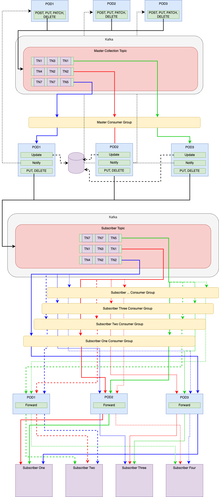

# Multi Tenant Data synchronization with Kafka

  This blog article describes a design pattern for leveraging Kafka for data synchronization horizontal scale by tenant with graceful degradation across consumers.

## Overview
Many teams are comfortable with REST API's and REST APIs are excellent for integrations when systems are not all collocated in the same network segment.
Exposing a KAFKA topic to the internet or to groups outside your direct area in your company, or to people in other companies, seems a huge risk that teams
are not comfortable with.  KAFKA's binary protocol is not a good fit for API Gateways and other technologies and thus is normally only used on private networks
and any connectivity to it from an external source normally requires a VPN.  And VPNs are no way to build integrations, nor is requiring all technologies to be
colocated in the same network segment.

The design pattern captured here is a fully developed design pattern for leveraging KAFKA as the mechanism to manage data synchronization
between a source and a set of consumers. Those consumers are all independent and it is important that one sick, dead, non-functional consumer
not impact any other consumers.  This pattern is significant when designing an integration pattern where different consumers are developed and
managed by different parties and whose lifecycles are all independent.  Each consumer independently can keep up, or fall behind, without affecting
the others.

As many data sets utilize tenancy for data isolation where each tenant is an independent data set.  This is an important aspect in this design
as it allows for scaling our processing such that data for each tenant, in a data stream, can be processed independently and this allows
changes for one tenant to be processed early or later than changes for another tenant without having any side effects.

## Kafka for data synchronization across groups

## Topic
Each Topic in Kafka is for a single stream of data for a particular data set.  A data set is a set of related data that
needs to be communicated together.  In the case of these examples the topic would be something such as Inventory, or Users,
as two simple examples.

## Partitions
Customers, aka Tenants, are used as the partition key.  This allows for a relatively good distribution of data across the kafka cluster
and more importantly this allows for good horizontal scale using consumer groups with kafka.

## Not losing updates
The easiest way to ensure that any change to the data is always forwarded to subscribers is done by using kafka to handle the update of
the master record.  All changes (Create/Update/Delete) are placed on a topic.  This then allows for a subscriber (ourself) to consume the
change and process it and then to place it on another topic to be sent to all subscribers.  If this fails at any point it will repeat the operation.

This only works for idempotent operations only.  i.e. ones that can be repeated and for which repeating does not change the outcome.
This is PUT, POST and DELETE with the following handling.  Note PATCH is also a possible pattern so long as it avoids elements such as INCremement or DECremeent.  
It will be very important to ensure true idempotency.

## Crash, restart, repeatability
Pods crash for a variety of reasons and we must be absolutely correct in ensuring the data is correctly processed and all downstream consumers have
an identical copy of the data.

## CREATE
The following would be the proposed pattern to properly handle craate with proper handling for crashing at any point during the exscution of the code for any reason.  

## UPDATE
The following would be the proposed pattern to properly handle craate with proper handling for crashing at any point during the exscution of the code for any reason.  

## DELETE
The following would be the proposed pattern to properly handle craate with proper handling for crashing at any point during the exscution of the code for any reason.  

